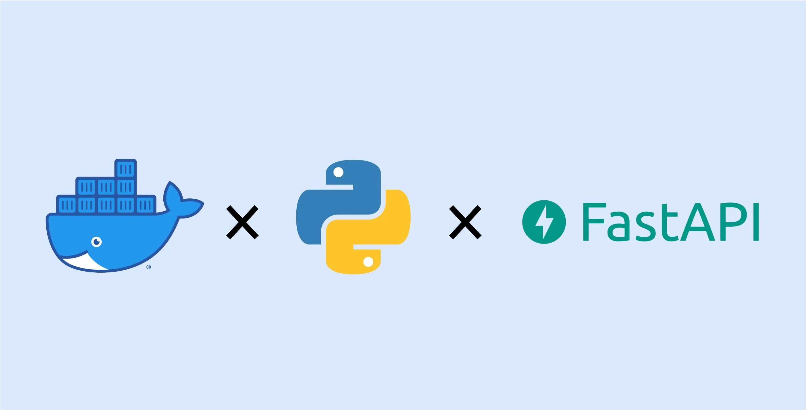
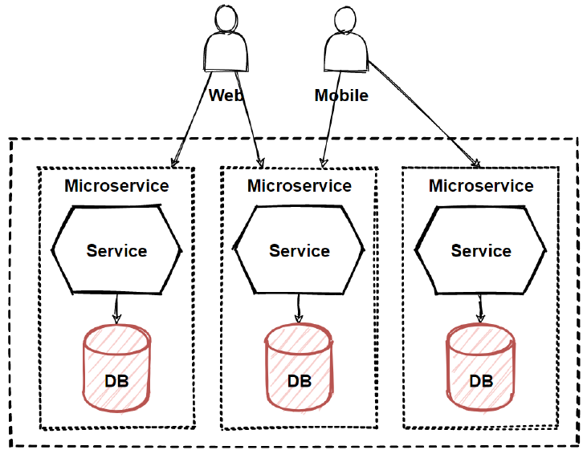

## Membangun User Service dengan FastAPI, SQLModel, Alembic, dan SQLite




Module ini dirancang sebagai **bahan** untuk Mata Kuliah *Microservice* sederhana yang dibangun menggunakan:

- **FastAPI** sebagai web framework,
- **SQLModel** sebagai ORM,
- **SQLite** sebagai database,
- **Pydantic** sebagai schema/validasi data, dan
- **Alembic** sebagai alat pengelola *database migration*.

---

### Tujuan Pembelajaran

Setelah mempelajari module ini, mahasiswa diharapkan mampu:

1. Membaca dan memahami penggunaan FastAPI.
2. Menulis model database menggunakan SQLModel dan menghubungkannya dengan SQLite.
3. Menulis schema Pydantic untuk memisahkan data yang disimpan di database dengan data yang keluar/masuk lewat API.
4. Mengelola perubahan struktur tabel dengan Alembic migration.
5. Menjalankan service dalam lingkungan lokal maupun menggunakan Docker.

---

### Gambaran Umum Skenario

Bayangkan kita sedang membangun sebuah sistem yang terdiri dari banyak layanan kecil (microservice). Salah satu layanan tersebut adalah **User Service**, yang hanya bertugas mengelola data user:

- menyimpan user baru,
- menampilkan daftar user,
- mengambil detail user berdasarkan ID.

Pada module ini, kita **hanya fokus pada User Service** karena biasanya service ini yang akan selalu di panggil oleh client. Service ini:

- memiliki database sendiri (sebuah file SQLite `app.db`),
- memiliki API endpoint sendiri (dibuat dengan FastAPI),
- bisa dijalankan secara terpisah (misalnya di container Docker tersendiri).

Di module-module berikutnya, pola yang sama bisa diulang untuk service lain, seperti `Product Service`, `Order Service`, dan sebagainya.

---

### Evironment Setup

Sebelum menyentuh kode, pastikan Anda berada di direktori module ini:

```bash
cd Module_1-Alembic_FastAPI_SQL_Lite
```

Untuk menjalankan project, kita bisa menggunakan *virtual environment* agar dependency tidak bercampur dengan project lain. Konsep ini sudah dibahas di pertemuan sebelumnya, tetapi secara singkat langkahnya:

1. **Membuat dan mengaktifkan virtual environment**

   ```bash
   python -m venv venv
   source venv/bin/activate  # Mac / Linux
   # atau
   venv\Scripts\activate     # Windows
   ```

2. **Menginstall dependency**

   Di dalam file `requirements.txt` sudah tercantum semua library yang dibutuhkan (FastAPI, SQLModel, Alembic, dll.). Jalankan:

   ```bash
   pip install -r requirements.txt
   ```

Setelah dua langkah ini, Python Anda sudah siap untuk di step berikutnya.

---

### Struktur Project

Struktur direktori project pada module ini dibuat seperti berikut:

```text
module-fast-api/
├── app/
│   ├── main.py        # Entry point FastAPI (router / endpoint)
│   ├── database.py    # Koneksi database + session
│   ├── models.py      # SQLModel (ORM)
│   └── schemas.py     # Pydantic schema (request/response)
├── alembic.ini        # Konfigurasi Alembic
├── alembic/
│   ├── env.py
│   └── versions/
│       └── 0001_create_user_table.py
├── app.db             # File SQLite (akan terbentuk setelah migration / running)
├── requirements.txt
└── README.MD
```

> Tidak ada aturan khusus mengenai sturkur dalam module ini, anda bisa bereksplorasi sendiri dengan melihat refrensi penggunaan OnionArchitecture, D3 dan sebagainya.

---

### Konsep Dasar yang Digunakan

- **FastAPI**: framework web modern untuk membuat API yang cepat, dan otomatis menghasilkan dokumentasi Swagger.
- **Pydantic Schema (`schemas.py`)**: mendefinisikan bentuk data yang diterima / dikirim API (request / response).
- **SQLModel (`models.py`)**: ORM yang menggabungkan kemudahan Pydantic + SQLAlchemy, sehingga kita bisa mendefinisikan model database berbasis *type hints*.
- **Alembic**: tool untuk mengelola perubahan struktur tabel (*migration*) secara versi.
- **SQLite**: database ringan berbasis file.

>Terdapat juga template docker untuk memperumuda dalam provisioning DB

---

### Database & SQLModel

File: `app/database.py`

- Mengatur koneksi SQLite dengan URL: `sqlite:///./app.db`
- Membuat `engine` dan fungsi `create_db_and_tables()` untuk membuat tabel dari `SQLModel.metadata`.
- Fungsi `get_session()` digunakan sebagai dependency di FastAPI (injection `Session`).

File: `app/models.py`

- `User` adalah model yang mewakili tabel `user` di database.
- Menggunakan `Field` untuk mendefinisikan kolom, *primary key*, index, dan constraint lain.

---

### Pydantic Schema

File: `app/schemas.py`

- `UserBase`: field umum yang dipakai baik oleh input (create) maupun output (read).
- `UserCreate`: schema untuk data yang diterima ketika membuat user baru (*request body*).
- `UserRead`: schema untuk data yang dikembalikan oleh API (*response*), berisi `id` dan `created_at` juga.

Perhatikan `class Config` pada `UserRead`:

```python
class Config:
    from_attributes = True
```

Ini mengizinkan Pydantic membaca data langsung dari objek SQLModel/ORM.

---

### Endpoint FastAPI

File: `app/main.py`

Endpoint utama:

- **`GET /health`**  
  Cek apakah service berjalan.

- **`POST /users`**  
  Membuat user baru di database.

- **`GET /users`**  
  Mengambil semua user.

- **`GET /users/{user_id}`**  
  Mengambil satu user berdasarkan `id`.

Pada event `startup`, dipanggil `create_db_and_tables()` untuk memastikan tabel sudah ada.

---

### Alembic & Migration

Di project kecil atau saat belajar, sering kali kita langsung membuat tabel dengan memanggil fungsi seperti `create_db_and_tables()` yang membaca seluruh model dan membuat tabel di database. Cara ini cepat dan praktis, tetapi **tidak menyimpan sejarah perubahan struktur tabel**.  

Dalam aplikasi nyata yang terus berkembang, kita butuh cara yang lebih terkontrol untuk:

- menambah kolom baru,
- mengubah tipe data,
- membuat atau menghapus tabel,
- dan memastikan perubahan tersebut konsisten di semua environment (local, staging, production).

Di sinilah **Alembic** berperan sebagai *version control* untuk database. Anda bisa membayangkan Alembic seperti `git`, tetapi untuk struktur tabel:

- Setiap perubahan struktur dicatat dalam **file migration** (mirip commit).
- Kita bisa **upgrade** ke versi terbaru atau **downgrade** ke versi sebelumnya.
- Tim bisa berbagi migration yang sama sehingga semua database punya bentuk tabel yang seragam.

Dalam module ini, ada beberapa file penting terkait Alembic:

- `alembic.ini`  
  Berisi konfigurasi umum Alembic, seperti:
  - di mana folder script Alembic berada (`alembic/`),
  - URL database yang akan dimodifikasi,
  - pengaturan logging.

- `alembic/env.py`  
  File ini menjembatani antara Alembic dan model yang kita definisikan di kode Python.  
  Di sini, `SQLModel.metadata` didaftarkan sebagai `target_metadata`, sehingga Alembic bisa:
  - mengetahui tabel apa saja yang ada,
  - membandingkan struktur sekarang dengan struktur lama (saat autogenerate).

- `alembic/versions/0001_create_user_table.py`  
  Ini adalah **file migration** pertama. Di dalamnya terdapat dua fungsi utama:
  - `upgrade()` → berisi perintah untuk *menerapkan* perubahan (misalnya membuat tabel `user`).
  - `downgrade()` → berisi perintah untuk *membalikkan* perubahan (misalnya menghapus tabel `user`).

Secara garis besar, alur kerja Alembic adalah:

1. Anda mengubah atau menambah model di `models.py`.
2. Anda membuat migration baru (bisa dengan autogenerate).
3. Anda menjalankan perintah `upgrade` untuk menerapkan migration tersebut ke database.

#### Cara menjalankan migration dasar

Setelah Alembic terinstall di environment Python Anda, jalankan:

```bash
alembic upgrade head
```

Penjelasan:

- `upgrade` artinya kita ingin menerapkan perubahan ke depan (naik versi).
- `head` artinya upgrade sampai versi migration paling terbaru.

Perintah ini akan membaca semua file di folder `alembic/versions/` yang belum pernah dijalankan, lalu mengeksekusi fungsi `upgrade()` di masing-masing file secara berurutan. Hasilnya, tabel `user` akan dibuat di `app.db`.

#### Menambah migration baru ketika model berubah

Di dalam real case, model jarang sekali dibuat secara manual. Jika kita ingin melakukan sebuah revisi, alembic sudah menyiapakan fitur tersebut untuk mempremudah kita membuat sebuah file revisinya. Misalnya, kita ingin menambah kolom `age` di tabel `user`. Alur yang dianjurkan:

1. **Ubah model di kode**
   - Tambahkan field baru di `app/models.py`, misalnya `age: int | None`.

2. **Buat file migration baru**
   - Biasanya menggunakan perintah:

     ```bash
     alembic revision --autogenerate -m "tambah kolom age di user"
     ```

   - Alembic akan:
     - membaca `SQLModel.metadata`,
     - membandingkannya dengan struktur database saat ini,
     - mencoba menghasilkan perintah SQL yang dibutuhkan (misalnya `ALTER TABLE user ADD COLUMN age INTEGER`).
   - Hasilnya berupa file baru di `alembic/versions/` dengan nama seperti `xxxx_tambah_kolom_age_di_user.py`.

3. **Terapkan migration baru**

   ```bash
   alembic upgrade head
   ```

   Perintah ini akan menjalankan fungsi `upgrade()` di migration baru tersebut, sehingga kolom `age` benar-benar ditambahkan ke tabel `user` di database.

Dengan kebiasaan menggunakan Alembic seperti ini, setiap perubahan struktur tabel:

- terdokumentasi dengan baik,
- bisa di-*review* (karena berupa file kode),
- dan bisa di-*rollback* jika terjadi kesalahan (menggunakan `alembic downgrade`).

---

### Menjalankan Aplikasi

Gunakan perintah berikut:

```bash
uvicorn app.main:app --reload
```

Kemudian buka browser ke:

- Dokumentasi Swagger: `http://127.0.0.1:8000/docs`
- Dokumentasi ReDoc: `http://127.0.0.1:8000/redoc`

Di Swagger, Anda dapat:

- Mencoba `GET /health`
- Membuat user baru via `POST /users`
- Menampilkan semua user via `GET /users`
- Mengambil detail user via `GET /users/{user_id}`

---

### Menjalankan dengan Docker (FastAPI + SQLite)

Anda juga bisa menjalankan service ini menggunakan Docker. SQLite disimpan di dalam file `app.db`, dan di-*mount* sebagai volume supaya data tetap ada walaupun container dihentikan.

#### a. Build dan run langsung Dockerfile

```bash
docker build -t fastapi-sqlite-app .
docker run --name fastapi-sqlite-container -p 8000:8000 fastapi-sqlite-app
```

Setelah itu, akses:

- `http://127.0.0.1:8000/docs`

File `app.db` akan berada di dalam container (tidak di host).

#### b. Menggunakan docker-compose (dengan volume SQLite)

Di project sudah ada file `docker-compose.yml`. Jalankan:

```bash
docker compose up --build
```

Penjelasan singkat:

- Service `fastapi-app` akan:
  - Build image dari `Dockerfile`.
  - Expose port `8000` ke host.
  - Menggunakan volume bernama `sqlite_data` yang di-*mount* ke `/app/app.db` di dalam container.  
    Ini membuat file SQLite *persistent* walaupun container dihapus.

Untuk menghentikan:

```bash
docker compose down
```

---

### Hubungan dengan Konsep Microservice



Dalam arsitektur **microservice**, setiap service biasanya:

- Memiliki **database sendiri / database per service** (tidak saling share langsung).
- Memiliki **endpoint** sendiri (API contract).
- Dideploy terpisah (bisa di container berbeda, port berbeda, dll.).

Dalam modul ini:

- **User Service** adalah contoh 1 microservice.
- Jika menambah **Product Service**, itu menjadi microservice lain.
- Kedua service bisa berkomunikasi lewat HTTP (REST) atau message broker (lebih lanjut di pertemuan lain).

Fokus modul ini adalah **membangun satu service dengan praktik yang rapi**:

- Pisah model (`models.py`) dan schema (`schemas.py`).
- Gunakan ORM (SQLModel) dan migration (Alembic).
- Gunakan SQLite untuk kemudahan praktikum (nanti bisa diganti PostgreSQL/MySQL dengan mengganti `DATABASE_URL`).

---

### Ringkasan

- **FastAPI** → untuk HTTP API.
- **Pydantic schema** → validasi & struktur data request/response.
- **SQLModel** → mapping model → tabel database.
- **Alembic** → mengelola versi perubahan struktur tabel (migration).
- **SQLite** → database ringan untuk praktikum.

Dengan memahami contoh ini, Anda sudah mempunyai pondasi kuat untuk membangun microservice lain dengan pola yang sama.

---

### Dokumentasi Resmi

Untuk memperdalam materi di module ini, sangat disarankan membaca dokumentasi resmi berikut:

- **FastAPI**  
  Dokumentasi resmi FastAPI: konsep dasar, tutorial, dan best practice.  
  `https://fastapi.tiangolo.com`

- **Pydantic**  
  Dokumentasi resmi Pydantic (digunakan FastAPI untuk validasi dan schema data).  
  `https://docs.pydantic.dev`

- **SQLModel**  
  Dokumentasi resmi SQLModel, termasuk contoh-contoh penggunaan dengan FastAPI.  
  `https://sqlmodel.tiangolo.com`

- **Alembic**  
  Dokumentasi resmi Alembic, menjelaskan konsep revision, upgrade/downgrade, dan autogenerate.  
  `https://alembic.sqlalchemy.org`

- **SQLite**  
  Dokumentasi resmi SQLite, jika ingin memahami tipe data, constraint, dan fitur-fitur SQL yang didukung.  
  `https://www.sqlite.org/docs.html`

Saat membaca dokumentasi resmi, coba hubungkan contoh yang ada di module ini dengan contoh di dokumentasi, sehingga Anda bisa melihat bahwa pola yang digunakan di kelas/praktikum selaras dengan best practice yang direkomendasikan pembuat library.

---

### Tugas

Sebagai latihan mandiri, silakan kembangkan:

1. **Tambah kolom baru di User**, misalnya `age: int | None` dan `is_active: bool = True`.
   - Ubah `models.py` dan `schemas.py` (supaya schema ikut mendukung field baru).
   - Buat migration baru dengan Alembic untuk menambah kolom di tabel.
2. **Buat endpoint update dan delete user**:
   - `PUT /users/{user_id}` → update data user.
   - `DELETE /users/{user_id}` → menghapus user.
3. **Buat service baru** (misalnya `Product Service`) di project yang sama:
   - Buat model `Product` di `models.py` atau file terpisah.
   - Buat schema Pydantic untuk `Product`.
   - Tambahkan endpoint CRUD baru di FastAPI.
   - Kelola struct perubahan tabel dengan Alembic.

Tujuannya: memahami pola yang sama bisa diulang untuk berbagai *microservice* kecil dengan domain berbeda.

